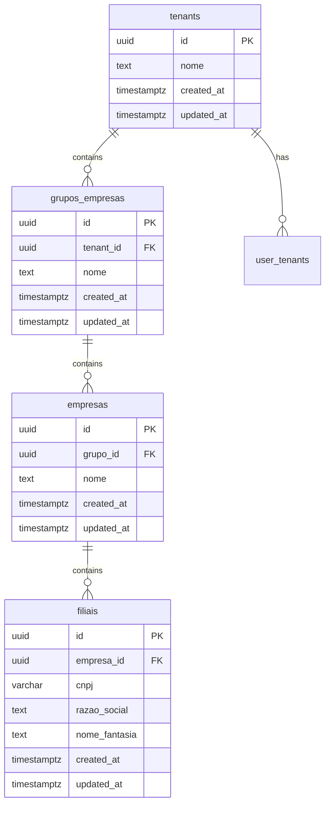
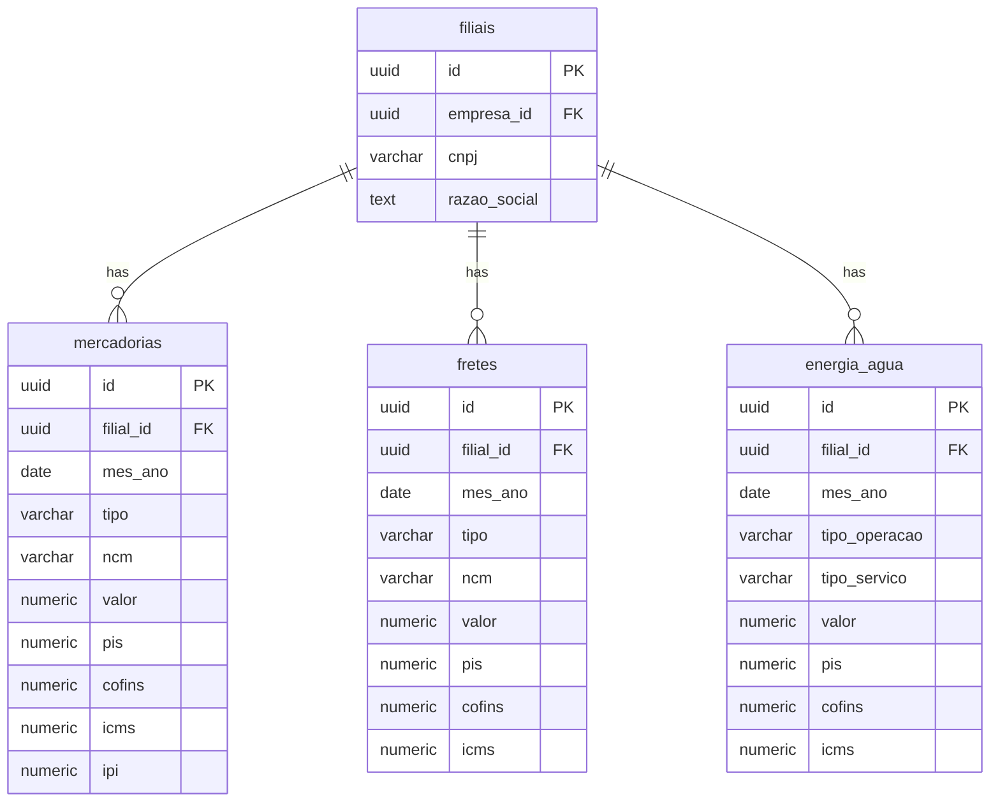
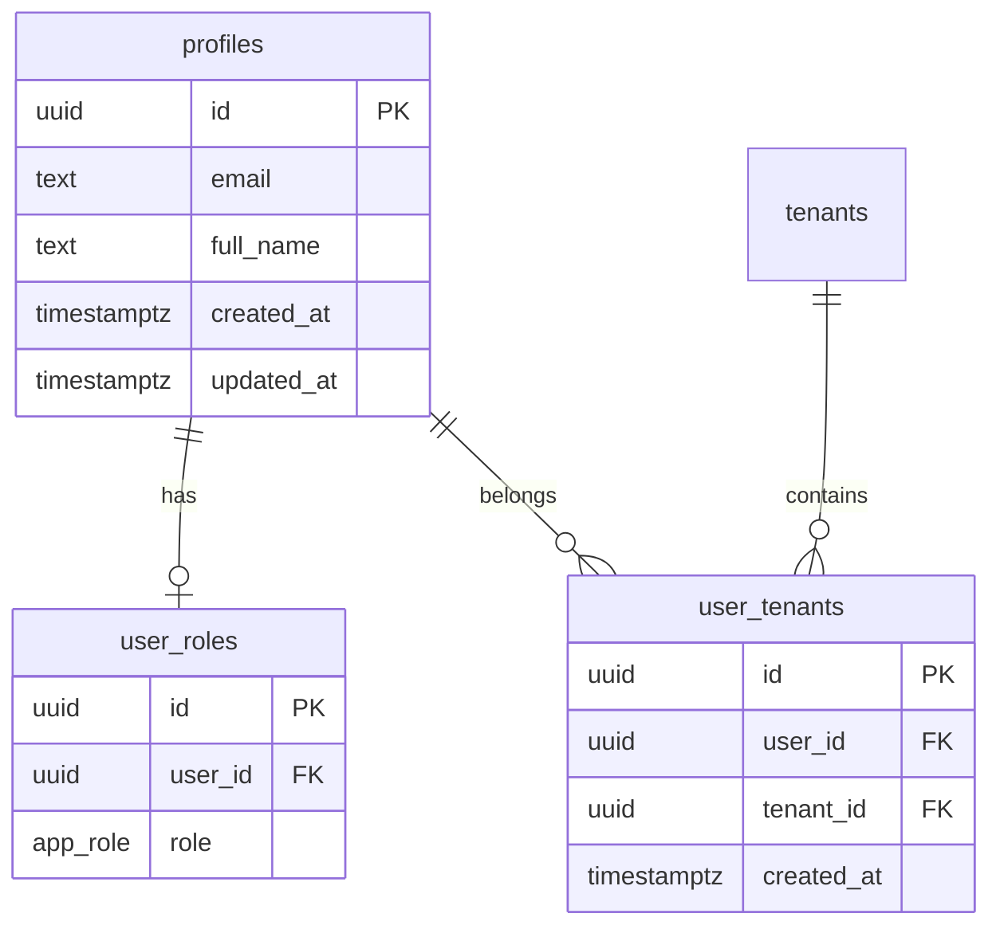
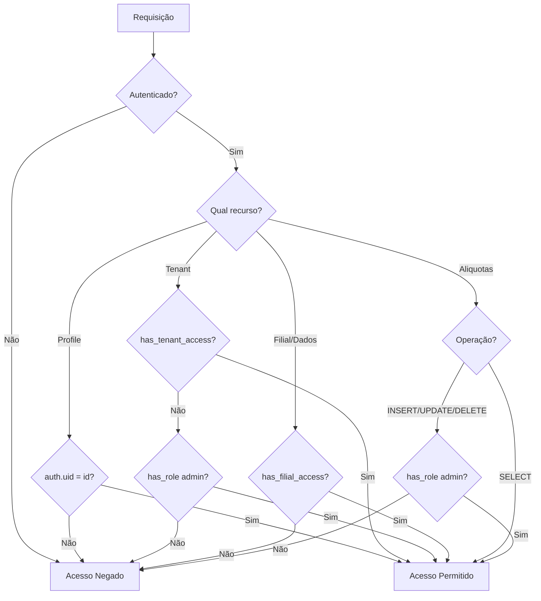
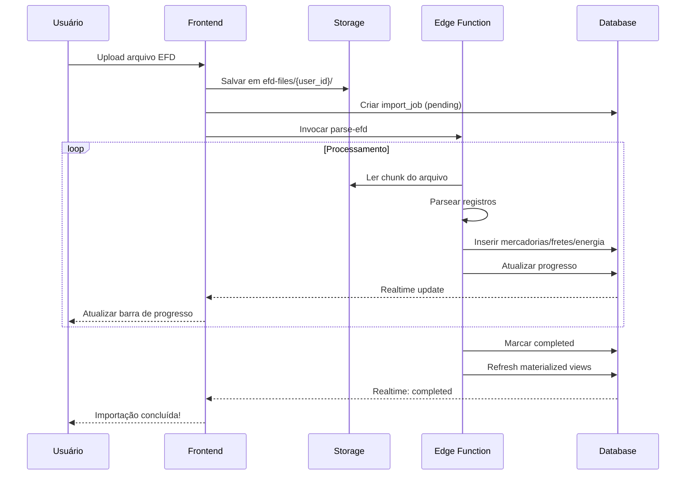

# Modelo de Dados - Sistema de Gestão Tributária

> Documentação técnica completa do modelo de dados para o sistema de gestão da Reforma Tributária brasileira.

**Versão:** 1.0  
**Última atualização:** Janeiro 2026  
**Banco de dados:** PostgreSQL (Supabase)

---

## Índice

1. [Visão Geral](#1-visão-geral)
2. [Hierarquia Organizacional](#2-hierarquia-organizacional)
3. [Gestão de Usuários](#3-gestão-de-usuários)
4. [Dados Transacionais](#4-dados-transacionais)
5. [Tabelas de Suporte](#5-tabelas-de-suporte)
6. [Funções de Segurança](#6-funções-de-segurança)
7. [Funções de Negócio](#7-funções-de-negócio)
8. [Materialized Views](#8-materialized-views)
9. [Políticas RLS](#9-políticas-rls)
10. [Índices de Performance](#10-índices-de-performance)
11. [Triggers](#11-triggers)
12. [Storage](#12-storage)
13. [Dados Iniciais](#13-dados-iniciais)
14. [Diagramas](#14-diagramas)

---

## 1. Visão Geral

### 1.1 Propósito do Sistema

O sistema foi desenvolvido para auxiliar empresas na gestão da transição tributária brasileira, permitindo:

- **Importação de arquivos EFD** (SPED Fiscal)
- **Cálculo de créditos e débitos** de PIS, COFINS, ICMS e IBS/CBS
- **Simulação de cenários** da reforma tributária (2027-2033)
- **Dashboards analíticos** para tomada de decisão

### 1.2 Arquitetura Multi-Tenant

O sistema utiliza arquitetura **multi-tenant** onde:

- Cada **tenant** representa um ambiente isolado (escritório contábil, empresa)
- Usuários podem pertencer a múltiplos tenants
- Dados são completamente isolados entre tenants via **Row Level Security (RLS)**

### 1.3 Extensões Utilizadas

```sql
CREATE EXTENSION IF NOT EXISTS "uuid-ossp";   -- Geração de UUIDs
CREATE EXTENSION IF NOT EXISTS "pgcrypto";    -- Criptografia
```

---

## 2. Hierarquia Organizacional

A estrutura organizacional segue uma hierarquia de 4 níveis:

```
Tenant → Grupo de Empresas → Empresa → Filial
```

### 2.1 Tabela: `tenants`

Representa o ambiente isolado de mais alto nível (multi-tenancy).

| Coluna | Tipo | Nullable | Default | Descrição |
|--------|------|----------|---------|-----------|
| `id` | UUID | Não | `gen_random_uuid()` | Identificador único |
| `nome` | TEXT | Não | `'Meu Ambiente'` | Nome do tenant |
| `created_at` | TIMESTAMPTZ | Não | `now()` | Data de criação |
| `updated_at` | TIMESTAMPTZ | Não | `now()` | Data de atualização |

**Características:**
- Primeiro nível da hierarquia
- Usuários são vinculados via `user_tenants`
- Apenas admins podem criar novos tenants

---

### 2.2 Tabela: `grupos_empresas`

Agrupa empresas dentro de um tenant (ex: holdings, grupos econômicos).

| Coluna | Tipo | Nullable | Default | Descrição |
|--------|------|----------|---------|-----------|
| `id` | UUID | Não | `gen_random_uuid()` | Identificador único |
| `tenant_id` | UUID | Não | - | FK para tenant |
| `nome` | TEXT | Não | - | Nome do grupo |
| `created_at` | TIMESTAMPTZ | Não | `now()` | Data de criação |
| `updated_at` | TIMESTAMPTZ | Não | `now()` | Data de atualização |

**Relacionamentos:**
- `tenant_id` → `tenants.id` (N:1)

---

### 2.3 Tabela: `empresas`

Representa uma empresa (pessoa jurídica) dentro de um grupo.

| Coluna | Tipo | Nullable | Default | Descrição |
|--------|------|----------|---------|-----------|
| `id` | UUID | Não | `gen_random_uuid()` | Identificador único |
| `grupo_id` | UUID | Não | - | FK para grupo |
| `nome` | TEXT | Não | - | Nome da empresa |
| `created_at` | TIMESTAMPTZ | Não | `now()` | Data de criação |
| `updated_at` | TIMESTAMPTZ | Não | `now()` | Data de atualização |

**Relacionamentos:**
- `grupo_id` → `grupos_empresas.id` (N:1)

---

### 2.4 Tabela: `filiais`

Representa uma filial (estabelecimento com CNPJ) de uma empresa.

| Coluna | Tipo | Nullable | Default | Descrição |
|--------|------|----------|---------|-----------|
| `id` | UUID | Não | `gen_random_uuid()` | Identificador único |
| `empresa_id` | UUID | Não | - | FK para empresa |
| `cnpj` | VARCHAR | Não | - | CNPJ (14 dígitos) |
| `razao_social` | TEXT | Não | - | Razão social |
| `nome_fantasia` | TEXT | Sim | - | Nome fantasia |
| `created_at` | TIMESTAMPTZ | Não | `now()` | Data de criação |
| `updated_at` | TIMESTAMPTZ | Não | `now()` | Data de atualização |

**Relacionamentos:**
- `empresa_id` → `empresas.id` (N:1)

**Restrições:**
- `cnpj` deve ter exatamente 14 caracteres numéricos
- CNPJ único por empresa (constraint UNIQUE em `empresa_id, cnpj`)

**Nota:** A filial é o nível operacional onde são registradas as transações fiscais (mercadorias, fretes, energia/água).

---

## 3. Gestão de Usuários

### 3.1 Enum: `app_role`

Define os papéis disponíveis no sistema:

```sql
CREATE TYPE public.app_role AS ENUM ('admin', 'user', 'viewer');
```

| Valor | Descrição | Permissões |
|-------|-----------|------------|
| `admin` | Administrador | CRUD em todas as tabelas, gerência de usuários |
| `user` | Usuário padrão | CRUD em dados transacionais |
| `viewer` | Visualizador | Somente leitura |

---

### 3.2 Tabela: `profiles`

Armazena informações de perfil dos usuários (sincronizado com `auth.users`).

| Coluna | Tipo | Nullable | Default | Descrição |
|--------|------|----------|---------|-----------|
| `id` | UUID | Não | - | ID do usuário (= auth.users.id) |
| `email` | TEXT | Não | - | Email do usuário |
| `full_name` | TEXT | Sim | - | Nome completo |
| `created_at` | TIMESTAMPTZ | Não | `now()` | Data de criação |
| `updated_at` | TIMESTAMPTZ | Não | `now()` | Data de atualização |

**Relacionamentos:**
- `id` → `auth.users.id` (1:1) - via trigger `handle_new_user`

**Nota:** Esta tabela é criada automaticamente quando um usuário se cadastra, através do trigger `on_auth_user_created`.

---

### 3.3 Tabela: `user_roles`

Associa usuários aos seus papéis (roles).

| Coluna | Tipo | Nullable | Default | Descrição |
|--------|------|----------|---------|-----------|
| `id` | UUID | Não | `gen_random_uuid()` | Identificador único |
| `user_id` | UUID | Não | - | ID do usuário |
| `role` | app_role | Não | `'user'` | Papel atribuído |

**Relacionamentos:**
- `user_id` → `auth.users.id` (N:1)

**Regras:**
- Primeiro usuário do sistema recebe `admin` automaticamente
- Demais usuários recebem `user` por padrão
- Um usuário pode ter apenas um role

---

### 3.4 Tabela: `user_tenants`

Vincula usuários aos tenants que podem acessar.

| Coluna | Tipo | Nullable | Default | Descrição |
|--------|------|----------|---------|-----------|
| `id` | UUID | Não | `gen_random_uuid()` | Identificador único |
| `user_id` | UUID | Não | - | ID do usuário |
| `tenant_id` | UUID | Não | - | ID do tenant |
| `created_at` | TIMESTAMPTZ | Não | `now()` | Data de criação |

**Relacionamentos:**
- `user_id` → `auth.users.id` (N:1)
- `tenant_id` → `tenants.id` (N:1)

**Restrições:**
- Constraint UNIQUE em `(user_id, tenant_id)` - evita duplicatas

---

## 4. Dados Transacionais

As tabelas transacionais armazenam os dados fiscais importados dos arquivos EFD.

### 4.1 Tabela: `mercadorias`

Registra operações de entrada e saída de mercadorias.

| Coluna | Tipo | Nullable | Default | Descrição |
|--------|------|----------|---------|-----------|
| `id` | UUID | Não | `gen_random_uuid()` | Identificador único |
| `filial_id` | UUID | Não | - | FK para filial |
| `mes_ano` | DATE | Não | - | Mês/ano de referência (dia=1) |
| `tipo` | VARCHAR | Não | - | `'entrada'` ou `'saida'` |
| `ncm` | VARCHAR | Sim | - | Código NCM (8 dígitos) |
| `descricao` | TEXT | Sim | - | Descrição do item |
| `valor` | NUMERIC | Não | `0` | Valor total da operação |
| `pis` | NUMERIC | Não | `0` | Valor de PIS |
| `cofins` | NUMERIC | Não | `0` | Valor de COFINS |
| `icms` | NUMERIC | Sim | `0` | Valor de ICMS |
| `ipi` | NUMERIC | Sim | `0` | Valor de IPI |
| `created_at` | TIMESTAMPTZ | Não | `now()` | Data de criação |
| `updated_at` | TIMESTAMPTZ | Não | `now()` | Data de atualização |

**Relacionamentos:**
- `filial_id` → `filiais.id` (N:1)

**Validações:**
- `tipo` deve ser `'entrada'` ou `'saida'`
- Valores fiscais devem ser >= 0

---

### 4.2 Tabela: `fretes`

Registra operações de frete (créditos e débitos).

| Coluna | Tipo | Nullable | Default | Descrição |
|--------|------|----------|---------|-----------|
| `id` | UUID | Não | `gen_random_uuid()` | Identificador único |
| `filial_id` | UUID | Não | - | FK para filial |
| `mes_ano` | DATE | Não | - | Mês/ano de referência |
| `tipo` | VARCHAR | Não | - | `'credito'` ou `'debito'` |
| `ncm` | VARCHAR | Sim | - | Código NCM |
| `descricao` | TEXT | Sim | - | Descrição |
| `cnpj_transportadora` | VARCHAR | Sim | - | CNPJ da transportadora |
| `valor` | NUMERIC | Não | `0` | Valor do frete |
| `pis` | NUMERIC | Não | `0` | Valor de PIS |
| `cofins` | NUMERIC | Não | `0` | Valor de COFINS |
| `icms` | NUMERIC | Não | `0` | Valor de ICMS |
| `created_at` | TIMESTAMPTZ | Não | `now()` | Data de criação |
| `updated_at` | TIMESTAMPTZ | Não | `now()` | Data de atualização |

**Relacionamentos:**
- `filial_id` → `filiais.id` (N:1)

**Validações:**
- `tipo` deve ser `'credito'` ou `'debito'`

---

### 4.3 Tabela: `energia_agua`

Registra despesas/créditos com utilidades e comunicação.

| Coluna | Tipo | Nullable | Default | Descrição |
|--------|------|----------|---------|-----------|
| `id` | UUID | Não | `gen_random_uuid()` | Identificador único |
| `filial_id` | UUID | Não | - | FK para filial |
| `mes_ano` | DATE | Não | - | Mês/ano de referência |
| `tipo_operacao` | VARCHAR | Não | - | `'credito'` ou `'debito'` |
| `tipo_servico` | VARCHAR | Não | - | Tipo do serviço |
| `descricao` | TEXT | Sim | - | Descrição |
| `cnpj_fornecedor` | VARCHAR | Sim | - | CNPJ do fornecedor |
| `valor` | NUMERIC | Não | `0` | Valor |
| `pis` | NUMERIC | Não | `0` | Valor de PIS |
| `cofins` | NUMERIC | Não | `0` | Valor de COFINS |
| `icms` | NUMERIC | Não | `0` | Valor de ICMS |
| `created_at` | TIMESTAMPTZ | Não | `now()` | Data de criação |
| `updated_at` | TIMESTAMPTZ | Não | `now()` | Data de atualização |

**Valores de `tipo_servico`:**
- `'energia'` - Energia elétrica
- `'agua'` - Água e saneamento
- `'gas'` - Gás natural/GLP
- `'comunicacao'` - Telecomunicações

**Relacionamentos:**
- `filial_id` → `filiais.id` (N:1)

---

## 5. Tabelas de Suporte

### 5.1 Tabela: `aliquotas`

Armazena as alíquotas da reforma tributária por ano.

| Coluna | Tipo | Nullable | Default | Descrição |
|--------|------|----------|---------|-----------|
| `id` | UUID | Não | `gen_random_uuid()` | Identificador único |
| `ano` | INTEGER | Não | - | Ano de vigência |
| `ibs_estadual` | NUMERIC | Não | `0` | Alíquota IBS estadual (%) |
| `ibs_municipal` | NUMERIC | Não | `0` | Alíquota IBS municipal (%) |
| `cbs` | NUMERIC | Não | `0` | Alíquota CBS federal (%) |
| `reduc_icms` | NUMERIC | Não | `0` | Redutor ICMS (%) |
| `reduc_piscofins` | NUMERIC | Não | `0` | Redutor PIS/COFINS (%) |
| `is_active` | BOOLEAN | Sim | `true` | Se está ativo |
| `created_at` | TIMESTAMPTZ | Não | `now()` | Data de criação |
| `updated_at` | TIMESTAMPTZ | Não | `now()` | Data de atualização |

**Restrições:**
- Constraint UNIQUE em `ano`
- Alíquotas devem estar entre 0 e 100

---

### 5.2 Tabela: `import_jobs`

Controla o status e progresso das importações de arquivos EFD.

| Coluna | Tipo | Nullable | Default | Descrição |
|--------|------|----------|---------|-----------|
| `id` | UUID | Não | `gen_random_uuid()` | Identificador único |
| `user_id` | UUID | Não | - | Usuário que iniciou |
| `empresa_id` | UUID | Não | - | Empresa de destino |
| `filial_id` | UUID | Sim | - | Filial (extraída do EFD) |
| `file_path` | TEXT | Não | - | Caminho no storage |
| `file_name` | TEXT | Não | - | Nome do arquivo |
| `file_size` | BIGINT | Não | `0` | Tamanho em bytes |
| `status` | TEXT | Não | `'pending'` | Status atual |
| `progress` | INTEGER | Não | `0` | Progresso (0-100) |
| `total_lines` | INTEGER | Não | `0` | Total de linhas |
| `bytes_processed` | BIGINT | Sim | `0` | Bytes processados |
| `chunk_number` | INTEGER | Sim | `0` | Chunk atual |
| `import_scope` | TEXT | Não | `'all'` | Escopo da importação |
| `record_limit` | INTEGER | Sim | `0` | Limite de registros |
| `counts` | JSONB | Não | `{...}` | Contadores |
| `error_message` | TEXT | Sim | - | Mensagem de erro |
| `started_at` | TIMESTAMPTZ | Sim | - | Início do processamento |
| `completed_at` | TIMESTAMPTZ | Sim | - | Fim do processamento |
| `created_at` | TIMESTAMPTZ | Não | `now()` | Data de criação |
| `updated_at` | TIMESTAMPTZ | Não | `now()` | Data de atualização |

**Valores de `status`:**
- `'pending'` - Aguardando processamento
- `'processing'` - Em processamento
- `'completed'` - Concluído com sucesso
- `'error'` - Erro no processamento
- `'cancelled'` - Cancelado pelo usuário

**Estrutura de `counts`:**
```json
{
  "mercadorias": 0,
  "fretes": 0,
  "energia_agua": 0
}
```

**Nota:** Esta tabela tem **Realtime** habilitado para atualização de progresso em tempo real.

---

### 5.3 Tabela: `audit_logs`

Registra ações de auditoria no sistema.

| Coluna | Tipo | Nullable | Default | Descrição |
|--------|------|----------|---------|-----------|
| `id` | UUID | Não | `gen_random_uuid()` | Identificador único |
| `user_id` | UUID | Não | - | Usuário que executou |
| `tenant_id` | UUID | Não | - | Tenant afetado |
| `action` | TEXT | Não | - | Ação executada |
| `table_name` | TEXT | Sim | - | Tabela afetada |
| `record_count` | INTEGER | Sim | - | Quantidade de registros |
| `details` | JSONB | Sim | - | Detalhes adicionais |
| `created_at` | TIMESTAMPTZ | Sim | `now()` | Data da ação |

**Valores comuns de `action`:**
- `'import_efd'` - Importação de arquivo EFD
- `'delete_batch'` - Exclusão em lote
- `'clear_data'` - Limpeza de dados
- `'reset_all'` - Reset completo

**Restrições:**
- Registros não podem ser atualizados ou deletados (imutável)

---

## 6. Funções de Segurança

Funções `SECURITY DEFINER` que implementam a lógica de controle de acesso.

### 6.1 `has_role()`

Verifica se um usuário possui determinado papel.

```sql
has_role(_user_id UUID, _role app_role) → BOOLEAN
```

**Uso:**
```sql
SELECT has_role(auth.uid(), 'admin');  -- true/false
```

---

### 6.2 `has_tenant_access()`

Verifica se um usuário tem acesso a um tenant.

```sql
has_tenant_access(_user_id UUID, _tenant_id UUID) → BOOLEAN
```

**Lógica:** Verifica se existe registro em `user_tenants` para o par (user_id, tenant_id).

---

### 6.3 `has_filial_access()`

Verifica se um usuário tem acesso a uma filial (através da hierarquia).

```sql
has_filial_access(_user_id UUID, _filial_id UUID) → BOOLEAN
```

**Lógica:** Navega a hierarquia `filial → empresa → grupo → tenant → user_tenants`.

```sql
SELECT EXISTS (
  SELECT 1 FROM filiais f
  JOIN empresas e ON e.id = f.empresa_id
  JOIN grupos_empresas g ON g.id = e.grupo_id
  JOIN user_tenants ut ON ut.tenant_id = g.tenant_id
  WHERE f.id = _filial_id AND ut.user_id = _user_id
)
```

---

### 6.4 `validate_tenant_exists()`

Verifica se um tenant existe.

```sql
validate_tenant_exists(_tenant_id UUID) → BOOLEAN
```

---

### 6.5 `get_tenant_name()`

Retorna o nome de um tenant.

```sql
get_tenant_name(_tenant_id UUID) → TEXT
```

---

## 7. Funções de Negócio

### 7.1 `update_updated_at_column()`

Função de trigger para atualizar automaticamente `updated_at`.

```sql
update_updated_at_column() → TRIGGER
```

**Uso:** Aplicada em todas as tabelas com coluna `updated_at`.

---

### 7.2 `get_mercadorias_aggregated()`

Retorna dados agregados de mercadorias com RLS aplicado.

```sql
get_mercadorias_aggregated() → TABLE(
  filial_id UUID,
  filial_nome TEXT,
  mes_ano DATE,
  tipo VARCHAR,
  valor NUMERIC,
  pis NUMERIC,
  cofins NUMERIC,
  icms NUMERIC
)
```

---

### 7.3 `delete_mercadorias_batch()`

Exclui mercadorias em lote com controle de acesso.

```sql
delete_mercadorias_batch(
  _user_id UUID,
  _filial_ids UUID[],
  _batch_size INTEGER DEFAULT 10000
) → INTEGER  -- quantidade excluída
```

**Nota:** Valida acesso via `has_filial_access()` antes de excluir.

---

### 7.4 `delete_fretes_batch()`

Exclui fretes em lote.

```sql
delete_fretes_batch(
  _user_id UUID,
  _filial_ids UUID[],
  _batch_size INTEGER DEFAULT 10000
) → INTEGER
```

---

### 7.5 `delete_energia_agua_batch()`

Exclui registros de energia/água em lote.

```sql
delete_energia_agua_batch(
  _user_id UUID,
  _filial_ids UUID[],
  _batch_size INTEGER DEFAULT 10000
) → INTEGER
```

---

### 7.6 `refresh_materialized_views()`

Atualiza todas as materialized views.

```sql
refresh_materialized_views() → VOID
```

**Comportamento:**
- Se as views estão vazias: usa `REFRESH MATERIALIZED VIEW`
- Se têm dados: usa `REFRESH MATERIALIZED VIEW CONCURRENTLY` (non-blocking)

---

### 7.7 `handle_new_user()`

Função de trigger para criação automática de perfil e role.

```sql
handle_new_user() → TRIGGER
```

**Lógica:**
1. Cria registro em `profiles` com email e nome
2. Verifica se existe algum admin no sistema
3. Se não existe admin: atribui `admin`
4. Se existe admin: atribui `user`

---

## 8. Materialized Views

Views materializadas para performance em consultas analíticas.

### 8.1 Schema: `extensions`

Todas as MVs residem no schema `extensions` para separação.

---

### 8.2 `mv_mercadorias_aggregated`

Agregação de mercadorias por filial, mês e tipo.

| Coluna | Tipo | Descrição |
|--------|------|-----------|
| `filial_id` | UUID | ID da filial |
| `filial_nome` | TEXT | Nome da filial |
| `mes_ano` | DATE | Mês/ano |
| `tipo` | TEXT | entrada/saída |
| `valor` | NUMERIC | Soma dos valores |
| `pis` | NUMERIC | Soma de PIS |
| `cofins` | NUMERIC | Soma de COFINS |
| `icms` | NUMERIC | Soma de ICMS |

**Função de acesso:** `get_mv_mercadorias_aggregated()`

---

### 8.3 `mv_fretes_aggregated`

Agregação de fretes por filial, mês e tipo.

| Coluna | Tipo | Descrição |
|--------|------|-----------|
| `filial_id` | UUID | ID da filial |
| `filial_nome` | TEXT | Nome da filial |
| `mes_ano` | DATE | Mês/ano |
| `tipo` | TEXT | crédito/débito |
| `valor` | NUMERIC | Soma dos valores |
| `pis` | NUMERIC | Soma de PIS |
| `cofins` | NUMERIC | Soma de COFINS |
| `icms` | NUMERIC | Soma de ICMS |

**Função de acesso:** `get_mv_fretes_aggregated()`

---

### 8.4 `mv_energia_agua_aggregated`

Agregação de energia/água por filial, mês e tipos.

| Coluna | Tipo | Descrição |
|--------|------|-----------|
| `filial_id` | UUID | ID da filial |
| `filial_nome` | TEXT | Nome da filial |
| `mes_ano` | DATE | Mês/ano |
| `tipo_operacao` | TEXT | crédito/débito |
| `tipo_servico` | TEXT | energia/água/gás/comunicação |
| `valor` | NUMERIC | Soma dos valores |
| `pis` | NUMERIC | Soma de PIS |
| `cofins` | NUMERIC | Soma de COFINS |
| `icms` | NUMERIC | Soma de ICMS |

**Função de acesso:** `get_mv_energia_agua_aggregated()`

---

### 8.5 `mv_dashboard_stats`

Estatísticas consolidadas para dashboard.

| Coluna | Tipo | Descrição |
|--------|------|-----------|
| `filial_id` | UUID | ID da filial |
| `categoria` | TEXT | mercadorias/fretes/energia_agua |
| `subtipo` | TEXT | Tipo específico |
| `mes_ano` | DATE | Mês/ano |
| `valor` | NUMERIC | Soma dos valores |
| `icms` | NUMERIC | Soma de ICMS |
| `pis` | NUMERIC | Soma de PIS |
| `cofins` | NUMERIC | Soma de COFINS |

**Função de acesso:** `get_mv_dashboard_stats(_mes_ano DATE DEFAULT NULL)`

---

## 9. Políticas RLS

Row Level Security está habilitado em todas as tabelas para isolamento de dados.

### 9.1 Matriz de Políticas

| Tabela | SELECT | INSERT | UPDATE | DELETE |
|--------|--------|--------|--------|--------|
| `profiles` | Próprio | Próprio | Próprio | ❌ |
| `user_roles` | Próprio | Admin | Admin | Admin |
| `user_tenants` | Próprio | Próprio/Admin | Admin | Admin |
| `tenants` | Vinculado | Admin | Vinculado | Admin |
| `grupos_empresas` | Tenant | Admin+Tenant | Tenant | Tenant |
| `empresas` | Grupo | Admin+Grupo | Grupo | Grupo |
| `filiais` | Acesso | Admin+Empresa | Acesso | Acesso |
| `mercadorias` | Filial | Filial | Filial | Filial |
| `fretes` | Filial | Filial | Filial | Filial |
| `energia_agua` | Filial | Filial | Filial | Filial |
| `aliquotas` | Todos | Admin | Admin | Admin |
| `import_jobs` | Próprio | Próprio | Próprio | Próprio |
| `audit_logs` | Tenant | Próprio | ❌ | ❌ |

### 9.2 Legenda

| Termo | Significado |
|-------|-------------|
| Próprio | `auth.uid() = user_id` |
| Admin | `has_role(auth.uid(), 'admin')` |
| Vinculado | Existe em `user_tenants` |
| Tenant | `has_tenant_access()` |
| Grupo | Acesso via tenant do grupo |
| Acesso | `has_filial_access()` |
| Filial | `has_filial_access()` |
| Todos | `true` (autenticados) |

---

### 9.3 Exemplos de Políticas

**Profiles - Usuário vê próprio perfil:**
```sql
CREATE POLICY "Users can view own profile"
ON profiles FOR SELECT
USING (auth.uid() = id);
```

**Mercadorias - Acesso via hierarquia:**
```sql
CREATE POLICY "Users can view mercadorias of their filiais"
ON mercadorias FOR SELECT
USING (has_filial_access(auth.uid(), filial_id));
```

**Tenants - Admin gerencia:**
```sql
CREATE POLICY "Admins can manage tenants"
ON tenants FOR ALL
USING (has_role(auth.uid(), 'admin'));
```

---

## 10. Índices de Performance

### 10.1 Tabelas Transacionais

```sql
-- Mercadorias
CREATE INDEX idx_mercadorias_filial_mes ON mercadorias(filial_id, mes_ano);
CREATE INDEX idx_mercadorias_tipo ON mercadorias(tipo);
CREATE INDEX idx_mercadorias_ncm ON mercadorias(ncm) WHERE ncm IS NOT NULL;

-- Fretes
CREATE INDEX idx_fretes_filial_mes ON fretes(filial_id, mes_ano);
CREATE INDEX idx_fretes_tipo ON fretes(tipo);

-- Energia/Água
CREATE INDEX idx_energia_agua_filial_mes ON energia_agua(filial_id, mes_ano);
CREATE INDEX idx_energia_agua_tipo ON energia_agua(tipo_operacao, tipo_servico);
```

### 10.2 Hierarquia Organizacional

```sql
CREATE INDEX idx_grupos_tenant ON grupos_empresas(tenant_id);
CREATE INDEX idx_empresas_grupo ON empresas(grupo_id);
CREATE INDEX idx_filiais_empresa ON filiais(empresa_id);
CREATE INDEX idx_filiais_cnpj ON filiais(cnpj);
```

### 10.3 Usuários

```sql
CREATE INDEX idx_user_tenants_user ON user_tenants(user_id);
CREATE INDEX idx_user_tenants_tenant ON user_tenants(tenant_id);
CREATE INDEX idx_user_roles_user ON user_roles(user_id);
CREATE INDEX idx_profiles_email ON profiles(email);
```

### 10.4 Suporte

```sql
CREATE INDEX idx_import_jobs_user ON import_jobs(user_id);
CREATE INDEX idx_import_jobs_status ON import_jobs(status);
CREATE INDEX idx_import_jobs_empresa ON import_jobs(empresa_id);
CREATE INDEX idx_audit_logs_user ON audit_logs(user_id);
CREATE INDEX idx_audit_logs_tenant ON audit_logs(tenant_id);
CREATE INDEX idx_audit_logs_action ON audit_logs(action);
```

---

## 11. Triggers

### 11.1 `on_auth_user_created`

Cria perfil e role automaticamente quando usuário se cadastra.

```sql
CREATE TRIGGER on_auth_user_created
  AFTER INSERT ON auth.users
  FOR EACH ROW
  EXECUTE FUNCTION handle_new_user();
```

**Nota:** Este trigger deve ser criado manualmente no Supabase Dashboard pois está no schema `auth`.

---

### 11.2 Triggers de `updated_at`

Atualizam automaticamente o campo `updated_at`.

```sql
-- Exemplo para profiles
CREATE TRIGGER update_profiles_updated_at
  BEFORE UPDATE ON profiles
  FOR EACH ROW
  EXECUTE FUNCTION update_updated_at_column();
```

**Tabelas com trigger:**
- `profiles`
- `tenants`
- `grupos_empresas`
- `empresas`
- `filiais`
- `aliquotas`
- `mercadorias`
- `fretes`
- `energia_agua`
- `import_jobs`

---

## 12. Storage

### 12.1 Bucket: `efd-files`

Armazena arquivos EFD (SPED Fiscal) para importação.

| Propriedade | Valor |
|-------------|-------|
| Nome | `efd-files` |
| Público | Não |
| Limite de arquivo | 50 MB |
| MIME types | `text/plain`, `application/octet-stream` |

---

### 12.2 Políticas de Storage

```sql
-- Upload: usuário autenticado, pasta própria
CREATE POLICY "Users can upload EFD files"
ON storage.objects FOR INSERT
WITH CHECK (
  bucket_id = 'efd-files' 
  AND auth.uid()::text = (storage.foldername(name))[1]
);

-- Visualização: próprios arquivos
CREATE POLICY "Users can view own EFD files"
ON storage.objects FOR SELECT
USING (
  bucket_id = 'efd-files' 
  AND auth.uid()::text = (storage.foldername(name))[1]
);

-- Exclusão: próprios arquivos
CREATE POLICY "Users can delete own EFD files"
ON storage.objects FOR DELETE
USING (
  bucket_id = 'efd-files' 
  AND auth.uid()::text = (storage.foldername(name))[1]
);
```

**Estrutura de pastas:**
```
efd-files/
  └── {user_id}/
      └── {timestamp}_{filename}.txt
```

---

## 13. Dados Iniciais

### 13.1 Alíquotas da Reforma Tributária (2027-2033)

| Ano | IBS Estadual | IBS Municipal | CBS | Redução ICMS | Redução PIS/COFINS |
|-----|--------------|---------------|-----|--------------|-------------------|
| 2027 | 0.1% | 0.1% | 0.9% | 0% | 0% |
| 2028 | 0.1% | 0.1% | 0.9% | 0% | 0% |
| 2029 | 1.3% | 0.7% | 7.95% | 10% | 0% |
| 2030 | 2.6% | 1.4% | 7.95% | 20% | 0% |
| 2031 | 3.9% | 2.1% | 7.95% | 30% | 0% |
| 2032 | 5.2% | 2.8% | 7.95% | 40% | 0% |
| 2033 | 6.5% | 3.5% | 8.8% | 100% | 100% |

---

## 14. Diagramas

### 14.1 Diagrama ER - Hierarquia Organizacional



### 14.2 Diagrama ER - Dados Transacionais



### 14.3 Diagrama ER - Usuários e Permissões



### 14.4 Fluxo de Verificação de Permissões



### 14.5 Fluxo de Importação EFD



---

## Apêndice A: Configuração Pós-Instalação

### A.1 Criar Trigger em auth.users

Executar no SQL Editor do Supabase:

```sql
CREATE TRIGGER on_auth_user_created
  AFTER INSERT ON auth.users
  FOR EACH ROW
  EXECUTE FUNCTION public.handle_new_user();
```

### A.2 Habilitar Realtime

```sql
ALTER PUBLICATION supabase_realtime ADD TABLE public.import_jobs;
```

### A.3 Verificar Extensões

```sql
SELECT * FROM pg_extension WHERE extname IN ('uuid-ossp', 'pgcrypto');
```

---

## Apêndice B: Queries Úteis

### B.1 Verificar Acesso de Usuário

```sql
-- Verificar roles
SELECT * FROM user_roles WHERE user_id = 'UUID';

-- Verificar tenants vinculados
SELECT t.* FROM tenants t
JOIN user_tenants ut ON ut.tenant_id = t.id
WHERE ut.user_id = 'UUID';

-- Verificar filiais acessíveis
SELECT f.* FROM filiais f
WHERE has_filial_access('UUID', f.id);
```

### B.2 Estatísticas por Tenant

```sql
SELECT 
  t.nome as tenant,
  COUNT(DISTINCT g.id) as grupos,
  COUNT(DISTINCT e.id) as empresas,
  COUNT(DISTINCT f.id) as filiais
FROM tenants t
LEFT JOIN grupos_empresas g ON g.tenant_id = t.id
LEFT JOIN empresas e ON e.grupo_id = g.id
LEFT JOIN filiais f ON f.empresa_id = e.id
GROUP BY t.id, t.nome;
```

### B.3 Contagem de Registros Transacionais

```sql
SELECT 
  'mercadorias' as tabela,
  COUNT(*) as total
FROM mercadorias
UNION ALL
SELECT 'fretes', COUNT(*) FROM fretes
UNION ALL
SELECT 'energia_agua', COUNT(*) FROM energia_agua;
```

---

*Documentação gerada automaticamente - Sistema de Gestão Tributária v1.0*
